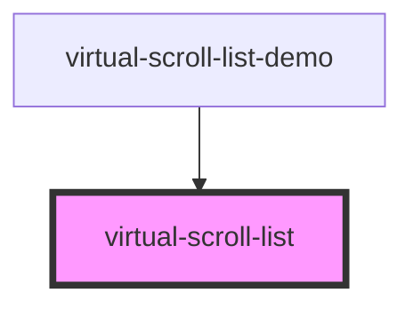

# virtual-scroll-list

<!-- Auto Generated Below -->

## Properties

| Property                           | Attribute               | Description | Type                                                                                                                            | Default     |
| ---------------------------------- | ----------------------- | ----------- | ------------------------------------------------------------------------------------------------------------------------------- | ----------- |
| `estimatedItemHeight` _(required)_ | `estimated-item-height` |             | `number`                                                                                                                        | `undefined` |
| `itemCount` _(required)_           | `item-count`            |             | `number`                                                                                                                        | `undefined` |
| `itemHeights` _(required)_         | --                      |             | `number[]`                                                                                                                      | `undefined` |
| `itemWidth` _(required)_           | `item-width`            |             | `number`                                                                                                                        | `undefined` |
| `renderItem` _(required)_          | --                      |             | `(i: number) => string \| number \| VNode \| Promise<ChildType> \| ChildType[] \| Promise<ChildType[]> \| Promise<ChildType>[]` | `undefined` |

## Dependencies

### Used by

 - [virtual-scroll-list-demo](../virtual-scroll-list-demo)

### Graph

----------------------------------------------

*Built with [StencilJS](https://stenciljs.com/)*
