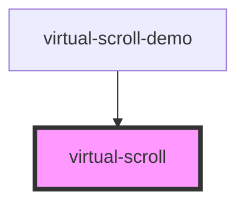

# virtual-scroll

<!-- Auto Generated Below -->

## Properties

| Property                  | Attribute          | Description | Type                                                                                                                            | Default     |
| ------------------------- | ------------------ | ----------- | ------------------------------------------------------------------------------------------------------------------------------- | ----------- |
| `autoDetectSize`          | `auto-detect-size` |             | `boolean`                                                                                                                       | `undefined` |
| `itemCount` _(required)_  | `item-count`       |             | `number`                                                                                                                        | `undefined` |
| `itemHeight`              | `item-height`      |             | `number`                                                                                                                        | `undefined` |
| `itemWidth`               | `item-width`       |             | `number`                                                                                                                        | `undefined` |
| `renderItem` _(required)_ | --                 |             | `(i: number) => string \| number \| VNode \| Promise<ChildType> \| ChildType[] \| Promise<ChildType[]> \| Promise<ChildType>[]` | `undefined` |
| `sameSize`                | `same-size`        |             | `boolean`                                                                                                                       | `undefined` |
| `tick`                    | `tick`             |             | `any`                                                                                                                           | `undefined` |

## Dependencies

### Used by

 - [virtual-scroll-demo](../virtual-scroll-demo)

### Graph

----------------------------------------------

*Built with [StencilJS](https://stenciljs.com/)*
